# "`Дипломный практикум в Yandex.Cloud`" - `Чернышов Андрей`

# Структура репозитория

```
.
├── bootstrap/          # Первичная инфраструктура
├── terraform/          # Основная инфраструктура
├── app/        	# Исходный код приложения
├── img/                # Скриншоты
├── k8s/		# Kubernetes-манифесты приложения
└── .github/workflows/  # GitHub Actions
```

### Структура проекта

Проект состоит из двух независимых Terraform-конфигураций `bootstrap/` и  `terraform/`

Такое разделение позволяет отделить долгоживущие ресурсы от вычислительной инфраструктуры и безопасно выполнять операции `terraform destroy` без удаления Terraform Backend и Container Registry.
---
Каталог `bootstrap/` содержит конфигурацию Terraform, предназначенную для создания базовой инфраструктуры, необходимой для работы основного проекта. 

В процессе развертывания создаются:

- Service Account;
- IAM-роли;
- KMS-ключ;
- Object Storage (S3 Backend) для хранения Terraform State;
- Yandex Container Registry.
---
После завершения развертывания каталог `terraform/` использует созданный Object Storage в качестве удалённого backend, а Container Registry — для хранения Docker-образов приложения.

Каталог содержит Terraform-конфигурацию основной инфраструктуры проекта, включая сетевую инфраструктуру, Managed Kubernetes, систему мониторинга и развертывание тестового приложения.

Создаются следующие ресурсы:

- виртуальная сеть (VPC);
- три подсети в разных зонах доступности;
- Managed Kubernetes Cluster;
- группа worker-нод (Node Group);
- сервисные аккаунты и IAM-роли;
- NGINX Ingress Controller;
- система мониторинга `kube-prometheus-stack` (Prometheus, Grafana, Alertmanager);
- namespace, Deployment, Service и Ingress тестового приложения.
---
Каталог `k8s/` содержит эталонные Kubernetes-манифесты приложения и компонентов мониторинга, использовавшиеся в процессе разработки и тестирования проекта.

Основное развертывание инфраструктуры и приложений выполняется средствами Terraform, однако манифесты сохранены в репозитории в качестве примеров конфигурации Kubernetes-ресурсов и могут использоваться для ручного развертывания.
---
Каталог `app/` содержит исходный код тестового веб-приложения и файлы, необходимые для сборки Docker-образа.

Собранный Docker-образ автоматически публикуется в Yandex Container Registry с помощью GitHub Actions.
---
Каталог `img/` содержит иллюстрации и скриншоты, используемые в документации проекта.
---
### Задание 1. Создание облачной инфраструктуры

Создан сервисный аккаунт Terraform с необходимыми IAM-ролями.

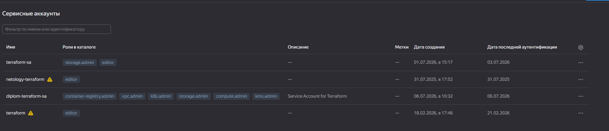  

Создан Object Storage для хранения Terraform State.

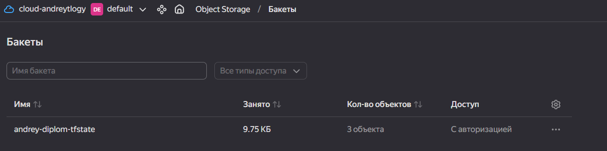

Создана виртуальная сеть и три подсети в разных зонах доступности.

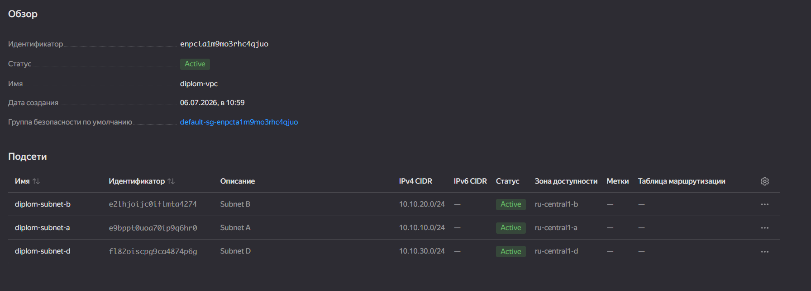

### Задание 2. Создание Kubernetes кластера 

Для выполнения задания был выбран сервис **Yandex Managed Service for Kubernetes**.

С помощью Terraform был развернут Kubernetes-кластер со следующими параметрами:

- региональный мастер Kubernetes;
- три worker-ноды, размещенные в разных зонах доступности (`ru-central1-a`, `ru-central1-b`, `ru-central1-d`);
- прерываемые виртуальные машины (Preemptible) для снижения стоимости инфраструктуры;
- конфигурация worker-нод:
  - 2 vCPU;
  - 2 ГБ RAM;
  - доля CPU 20%;
  - HDD-диск объемом 35 ГБ.

После создания кластера были получены учетные данные для подключения через `kubectl` и выполнена проверка его работоспособности.

Кластер успешно создан и находится в состоянии **Running**.

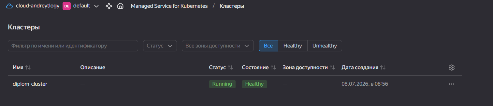

Проверка зарегистрированных узлов кластера: 

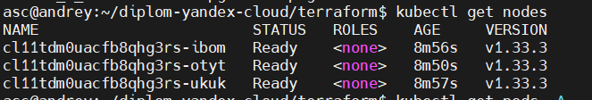

Проверка системных компонентов:

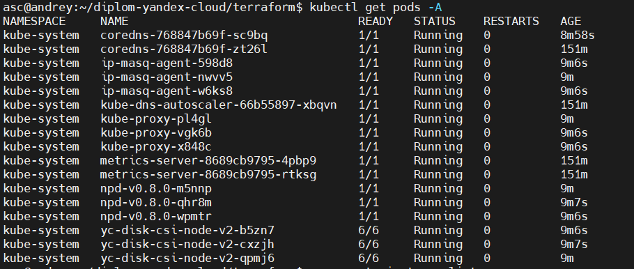

### Задание 3. Создание тестового приложения

В рамках данного этапа было подготовлено тестовое веб-приложение на базе nginx, отдающее статическую HTML-страницу.

Структура приложения:

| Файл | Назначение |
|------|------------|
| `Dockerfile` | Сборка Docker-образа на базе nginx |
| `nginx.conf` | Конфигурация веб-сервера nginx |
| `index.html` | Статическая страница тестового приложения |

Docker-образ приложения был собран и опубликован в Yandex Container Registry:

`cr.yandex/${REGISTRY_ID}/diplom-app:<TAG>`

Проверка наличия образа в Container Registry:

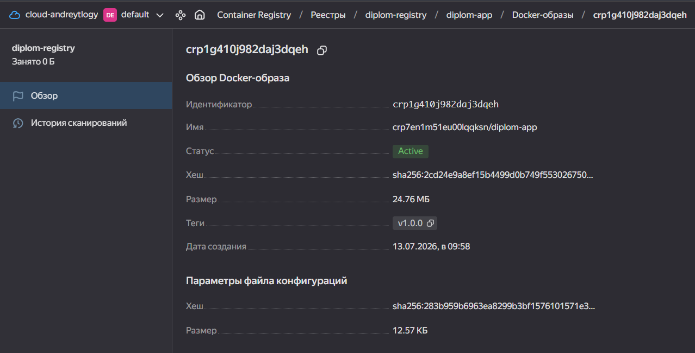

### Задание 4. Деплой приложения в Kubernetes

Для развертывания тестового приложения были подготовлены Kubernetes-манифесты, которые в дальнейшем были интегрированы в Terraform-конфигурацию для автоматического развертывания инфраструктуры.

| Файл | Назначение |
|------|------------|
| `namespace.yaml` | Создание отдельного namespace `diplom-app` |
| `deployment.yaml` | Развертывание двух реплик тестового приложения |
| `service.yaml` | Создание внутреннего сервиса типа `ClusterIP` |


Проверка состояния подов:

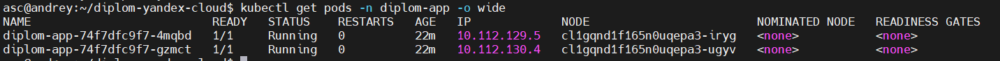

Проверка доступности приложения и health endpoint:

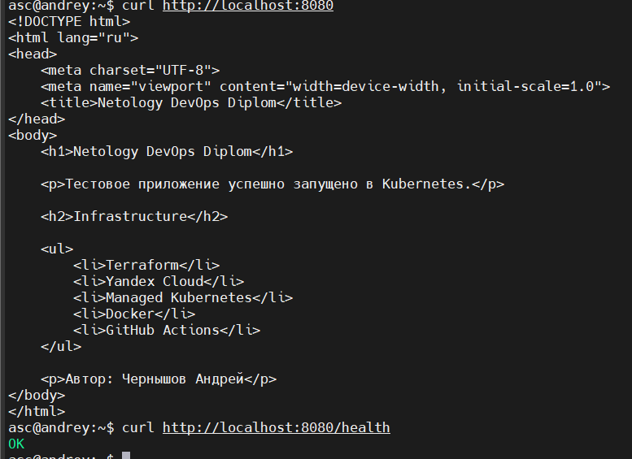

Для обеспечения внешнего доступа к приложению был установлен Nginx Ingress Controller.

Установка Ingress Controller автоматизирована с помощью Terraform и Helm Provider. Terraform подключается непосредственно к создаваемому Managed Kubernetes Cluster и устанавливает Helm chart `ingress-nginx` после создания группы worker-нод.

Для повышения воспроизводимости инфраструктуры Helm chart `ingress-nginx` версии `4.15.1` хранится локально в репозитории проекта. 

Сервис Ingress Controller имеет тип `LoadBalancer`. Yandex Cloud автоматически создает внешний Network Load Balancer и назначает публичный IP-адрес.

Приложение доступно извне по HTTP на стандартном порту `80`.

Проверка внешнего доступа к приложению:

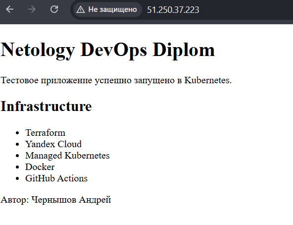

Проверка Ingress и внешнего Load Balancer:

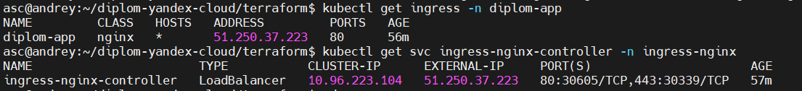


### Задание 5. Развертывание системы мониторинга

Для мониторинга Kubernetes-кластера используется `kube-prometheus-stack`, устанавливаемый автоматически с помощью Terraform и Helm Provider.

Используется Helm-чарт версии `87.16.1`.

В состав системы мониторинга входят:

- Prometheus;
- Grafana;
- Alertmanager;
- Prometheus Operator;
- kube-state-metrics;
- node-exporter.

`node-exporter` автоматически развернут на каждой из трех worker-нод Kubernetes-кластера.

Grafana опубликована через NGINX Ingress и доступна по адресу:

```
http://<EXTERNAL_IP>/grafana
```

После установки автоматически импортируются готовые Dashboard для Kubernetes.

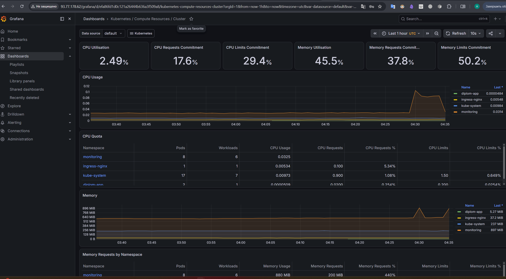

### Задание 6. CI/CD

Для автоматизации используются два GitHub Actions Workflow.

#### Terraform


При изменении файлов каталога `terraform/` автоматически выполняются:

- terraform init
- terraform validate
- terraform plan
- terraform apply

Инфраструктура поддерживается в актуальном состоянии.

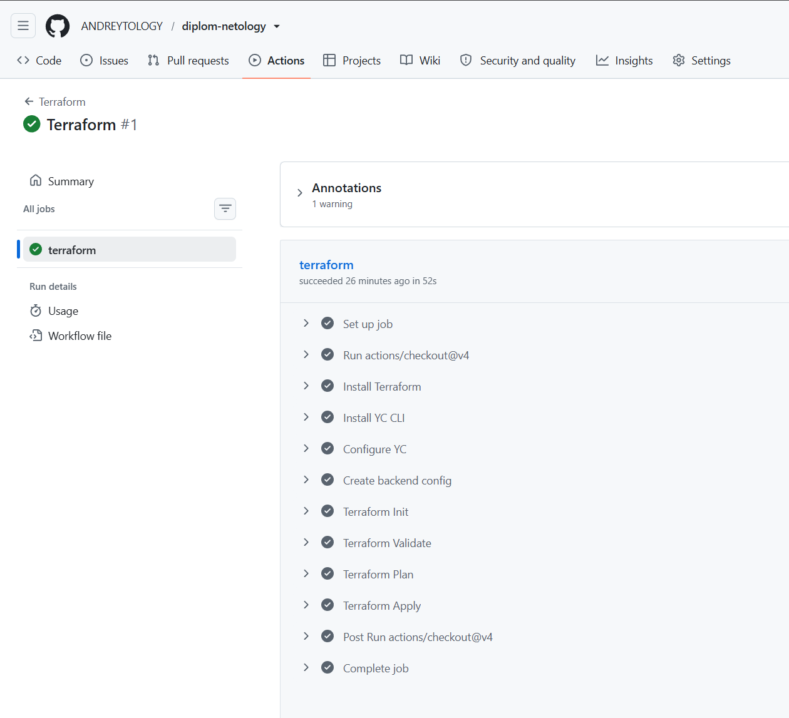

#### Docker CI/CD

При каждом коммите:

- собирается Docker Image;
- публикуется в Yandex Container Registry;
- создаётся тег по SHA коммита;
- автоматически обновляется Deployment Kubernetes;
- выполняется Rolling Update приложения.

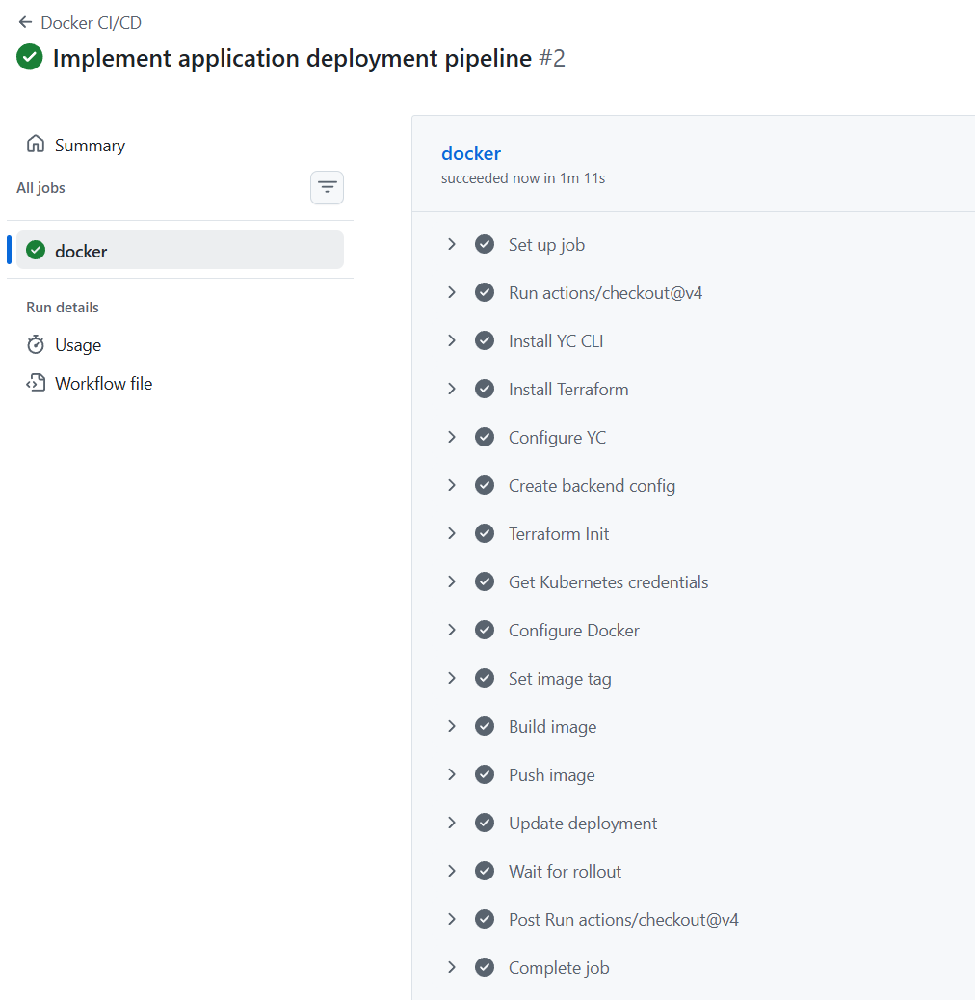


### Заключение

В ходе выполнения дипломного проекта была разработана полностью автоматизированная инфраструктура в Yandex Cloud с использованием принципов Infrastructure as Code.

В рамках проекта реализованы:

- создание облачной инфраструктуры с помощью Terraform;
- хранение Terraform State в Object Storage;
- развертывание Managed Kubernetes Cluster;
- автоматическая установка NGINX Ingress Controller;
- развертывание системы мониторинга на базе Prometheus и Grafana;
- публикация тестового приложения в Kubernetes;
- автоматическая сборка и публикация Docker-образов в Yandex Container Registry;
- автоматическое обновление приложения с использованием GitHub Actions;
- воспроизводимое развертывание инфраструктуры после полного удаления ресурсов.

В результате получена воспроизводимая DevOps-инфраструктура, полностью соответствующая требованиям дипломного проекта и демонстрирующая практическое применение современных инструментов автоматизации, контейнеризации, оркестрации и непрерывной доставки.
